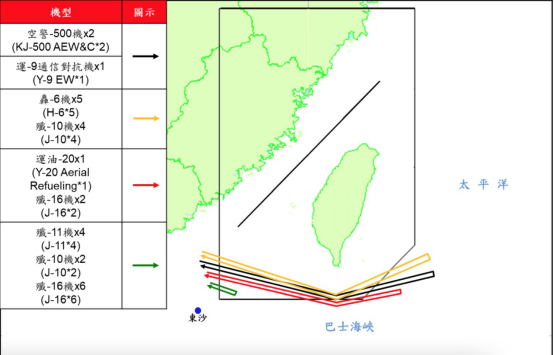

**统一台湾事件梳理**

中国百年民族复兴

民进党党纲基本主张

台湾前途决议文 https://taiwannext.com/%E8%87%BA%E7%81%A3%E5%89%8D%E9%80%94%E6%B1%BA%E8%AD%B0%E6%96%87/

2005年3月14日第十届全国人民代表大会第三次会议通过《反分裂国家法》

2017年9月29日，中共中央总书记习近平主持召开中共中央政治局会议，决定启动宪法修改工作。

2018年3月11日表决通过并同日施行修宪，其中一条：取消国家主席和国家副主席的连任限制，宪法第七十九条第三款删除“国家主席、副主席连续任职不得超过两届”。

2019年1月2日早间在《告台湾同胞书》发表**40**周年纪念会上的讲话中提出，两岸长期存在的政治分歧问题是影响两岸关系行稳致远的总根子，总不能一代一代传下去。中国人不打中国人。

习近平就推动两岸关系和平发展、实现祖国统一提出5点主张：第一，携手推动民族复兴，实现和平统一目标；第二，探索“两制”台湾方案，丰富和平统一实践；第三，坚持一个中国原则，维护和平统一前景；第四，深化两岸融合发展，夯实和平统一基础；第五，实现同胞心灵契合，增进和平统一认同。

（从1949至今72年，20岁去台湾的国民党人已经92岁。）

2019年1月2日下午，蔡英文回复不接受九二共识

2019年6月香港反送中

2019年12月新冠肺炎

2021年2月14日中共中央、国务院印发《国家综合立体交通网规划纲要》，

其中指出2035年京台高铁

我国的G3高速就是“京台高速”，是规划连接北京和台北的交通干线。2020年国庆节，京台高速公路长乐—平潭段正式通车，就差平潭—新竹—台北段了。

https://www.zhihu.com/tardis/sogou/qus/446903919

共青团微博说修路到台湾我们是认真的

台湾海峡通道最晚什么时候动工？预测2023年10月 https://zhuanlan.zhihu.com/p/430539779

2021年3月1日起禁止台湾凤梨输入

2021年3月24日 英特尔建晶圆厂

2021年5月12日，国台办发言人朱凤莲证实吴钊燮已被大陆列入“台独”顽固分子清单。

2021年5月3日，陆籍男子今(1日)凌晨在台中的西马头被发现,自称是从大陆福建开橡皮艇来台湾。

2021年5月13日，台湾大停电

2022年北京冬奥会

2021年6月19日

蔡政府同意经复星采购bnt，吴子嘉暗示2023年

https://www.youtube.com/watch?v=cxq__KMCoqs

2021年9月18日禁止释迦莲雾进口

2021年9月23日召开的第三次芯片峰会上，美国以芯片短缺为由，要求台积电、三星等芯片制造商交出库存量、订单、销售记录等数据。

2021年9月25日朱立伦当选国民党主席，习近平贺电，首次提出”为国家谋统一“

2021年9月26日电 全国台联成立40周年纪念大会暨第五届台胞社团论坛开幕式26日在京举行。中共中央政治局常委、全国政协主席汪洋出席并讲话。

首次未提“和平统一，一国两制”

汪洋强调，当前两岸关系发展机遇和挑战并存。两岸同胞要从中华民族根本利益出发，矢志坚守追求统一、支持统一、捍卫统一的民族大义，坚决反对任何形式的“台独”分裂行径，增强做中国人的志气、骨气、底气。要看清祖国必须统一也必然统一的历史大势，深刻认识解决台湾问题的主动权主导权始终掌握在祖国大陆这一边，坚定实现祖国完全统一的信心，广泛汇聚促进祖国统一的强大正能量。

30大讲话 http://www.taiwan.cn/xwzx/la/201111/t20111114_2152618.htm

20大讲话 http://www.taiwan.cn/lshshj/200202/t20020226_2304.htm

2021年9月30日，国台办发言人就吴钊燮猖狂谋“独”发表谈话。

2021年9月30日，国防部正告日本！“台湾的事，是中国的事，不关日本什么事”
日本防卫大臣岸信夫近日表示，中国以不透明的方式持续高水平地增加国防开支，加强军事力量，引发日本等地区国家和国际社会强烈担忧。钓鱼岛是日领土，日将捍卫相关岛屿主权。日台地理位置接近，台若出事，日亦无法置身事外。日防卫副大臣中山泰秀称，台湾有事就是日本有事。

2021年 解放军继10月1日、2日分别派出38架次、39架次军机进入台“防空识别区”后，解放军3日派出16架次军机进入台西南空域“防空识别区”。报道宣称，解放军最近3天已派93架次军机“扰台”，创台湾国防部公布统计以来最多架次纪录。10月4日派出56架次不断刷新纪录。

2021年10月6日蔡英文投书美国《外交事务》专文，署名“President of Taiwan.”

2021年10月9日纪念辛亥革命110周年大会
习近平强调，台湾问题因民族弱乱而产生，必将随着民族复兴而解决。这是中华民族历史演进大势所决定的，更是全体中华儿女的共同意志。以和平方式实现祖国统一，最符合包括台湾同胞在内的中华民族整体利益。我们坚持“和平统一、一国两制”的基本方针，坚持一个中国原则和“九二共识”，推动两岸关系和平发展。两岸同胞都要站在历史正确的一边，共同创造祖国完全统一、民族伟大复兴的光荣伟业。中华民族具有反对分裂、维护统一的光荣传统。凡是数典忘祖、背叛祖国、分裂国家的人，从来没有好下场，必将遭到人民的唾弃和历史的审判。台湾问题纯属中国内政，不容任何外来干涉。任何人都不要低估中国人民捍卫国家主权和领土完整的坚强决心、坚定意志、强大能力。祖国完全统一的历史任务一定要实现，也一定能够实现。

2021年10月10日人民日报署名钟声发表文章：祖国完全统一的历史任务一定要实现，也一定能够实现

2021年10月10日中华民国110周年大会蔡英文提出中华明国72年说法，未提辛亥革命，未提孙中山。提出四个坚持：永遠要堅持自由民主的憲政體制，堅持中華民國與中華人民共和國互不隸屬，堅持主權不容侵犯併吞，堅持中華民國台灣的前途，必須要遵循全體台灣人民的意志。提出准备修改宪法。双十节logo英语标语篡改为TAIWAN NATIONAL DAY马英九批中华民国国庆变台湾国庆，朱立伦张亚中强调孙中山理念。
（蔡英文提出“互不隶属”，继李登辉之后的新两国论）

2021年10月10日国台办回应双十讲话：这篇讲话鼓吹“台独”、煽动对立，割裂历史、扭曲事实，以所谓“共识、团结”为幌子图谋绑架台湾民意，勾连外部势力，为其谋“独”挑衅张目。

2021年10月13日，国台办发言人马晓光表示，两岸同属一个中国，两岸关系绝不是“国与国”关系，所谓“互不隶属”就是赤裸裸的贩卖“两国论”。

2021年10月10日央视新闻微博发起话题  #台湾是祖国的宝岛#  导语：实现祖国完全统一是海内外中华儿女的共同愿望，是中华民族的共同意志！台湾是祖国的宝岛，祖国必须统一！

2021年10月18日中俄海军共同穿越日本北海道与本州岛之间的津轻海峡。

2021年10月28日秦安：祖国必须统一，不计代价地动如雷霆后，冬季到台北去看雨

2021年10月30日第四届“国家统一与民族复兴”研讨会。中共中央台办、国务院台办副主任刘军川在视频致辞中表示，广大台湾同胞要看清祖国统一、民族复兴既是大义，更具大利。统一后，不仅台湾的和平安宁将充分保障，经济发展也将得到充分增进，民生福祉将充分提升，台湾的财政收入尽可用于改善民生。台湾同胞在国际上腰杆会更硬，共同参与全球治理和人类命运共同体构建。

2021年11月5日，国台办点名台当局行政机构负责人苏贞昌、民意机构负责人游锡堃、涉外部门主管吴钊燮等极少数“台独”顽固分子，针对他们一段时期以来的谋“独”恶劣言行，大陆方面依法对清单在列的上述“台独”顽固分子实施惩戒，禁止其本人及家属进入大陆和香港、澳门特别行政区，限制其关联机构与大陆有关组织、个人进行合作，绝不允许其关联企业和金主在大陆谋利，以及采取其它必要的惩戒措施。

2021年11月7日美国总统国家安全事务助理沙利文称美中关系“不是新冷战”，美国不再寻求改变中国体制，而是想与中国“共存”。专家认为，沙利文的表态说明，美国已经放弃通过接触、施压改变中国政治制度的幻想。

2021年11月8日在最后期限日，台积电“妥协”，上交了数据，同时一如既往强调“没有披露任何客户的具体信息”（9月23日）

2021年11月12日中国公路发文 【小鹿说路：沿着高速去台湾，2035能实现吗？】

2021年11月15日针对美国国务卿布林肯近日有关涉台言论，外交部发言人赵立坚11月15日在例行记者会上说，中方在台湾问题上的立场是一贯的、明确的。我们对美方的错误言行表示坚决反对。美方40多年来在台湾问题上的表述已经走样、变味、倒退，背离了中美建交时美方与中方达成的共识。美方应该遵守的是一个中国原则和中美三个联合公报，这是中美两国的重要政治共识，也是中美关系的政治基础。“所谓‘与台湾关系法’也好，所谓‘对台六项保证’也罢，纯粹是美国国内一些势力炮制出来的，都与中美三个联合公报背道而驰，实质是将美国内法凌驾于国际义务之上，是非法、无效的。”
赵立坚说，一段时间以来，民进党当局和“台独”分裂势力推行“去中国化”，搞“一中一台”“两个中国”，勾连外部势力大搞谋“独”挑衅活动，这是台海和平稳定的最大威胁，也是当前台海局势紧张的根源。中国统一是不可阻挡的历史潮流，坚持一中原则也是国际社会普遍共识。一切为“台独”撑腰打气的行径都是对中国内政的干涉，都不利于维护台海和平与稳定。美方应恪守一个中国原则和中美三个联合公报规定，慎重妥善处理台湾问题，以免损害中美关系和台海和平稳定。（记者温馨、朱超）

2021年11月16日，*中国共产党第三个历史决议*《中共中央关于党的百年奋斗重大成就和历史经验的决议》全文发布。（22次，铺垫3th）

2021年11月16日中美视讯会晤，习近平：中国实现完全统一，是全体中华儿女的共同愿望。我们是有耐心的，愿以最大诚意、尽最大努力争取和平统一的前景，但如果“台独”分裂势力挑衅逼迫，甚至突破红线，我们将不得不采取**断然**措施。

2021年11月19日新华社北京电题：背信弃义，立陶宛必将付出代价

2021年11月18日立陶宛批准台湾当局设立所谓“驻立陶宛台湾代表处”，“驻立陶宛台湾代表处”今天（18日）正式成立并挂牌运作

2021年11月20日据路透社11月19日独家报道，立陶宛经济部长奥林·阿莫奈特（Ausrine Armonaite）向其透露称，下周，立陶宛将与美国进出口银行签署一项6亿美元的出口信贷协议。

2021年11月20日《人民政协报》两岸经合周刊报道，如果未来两岸统一，除了台湾特别行政区财政收入可用于改善民生外，台湾普通民众恐怕最有感的好处，也最直接的好处，就是每人每年收入提高2万多元新台币。（军购、金援外交）

2021年11月22日新华社北京电 近期，上海、江苏、江西、湖北、四川等五省市有关执法部门开展执法检查，发现台湾远东集团在当地投资的化纤纺织、水泥企业在环保、土地利用、员工职业健康、安全生产及消防、税务、产品质量等方面存在一系列违法违规行为，依据国家法律法规对涉事企业采取罚款、追缴税款、限期整改等措施，并收回该企业闲置建设用地。

2021年11月28日台媒称运-20首度巡台。此外，根据台湾防务部门发布的解放军在台湾省西南空域活动示意图显示，此次参与巡台的解放军军机航程相较以往更远，甚至已经呈现出沿着台湾岛西南方向对台实现“半包围”的态势。

2021年12月11日，中共中央政治局常委、全国政协主席汪洋在厦门出席第十三届海峡论坛并致辞。汪洋强调，解决台湾问题、实现祖国完全统一，是中国共产党矢志不渝的历史任务，我们对此有必胜的信心。中国国民党主席朱立伦在视频致辞中表示，本党对稳定两岸关系负有重大责任，将秉持党章党纲规范，以增进民众福祉为己念，继续推动两岸关系和平发展。新党主席吴成典在大会发言中表示，只要有利于两岸和平统一，有利于两岸交流发展，新党一定全力以赴，绝不畏缩，台湾同胞要认清大势，共同推动和平统一。

2021年12月15日，国务院台湾事务办公室12月15日举行新闻发布会，发言人马晓光在回答记者提问时表示，汪洋主席的致辞，宣示了我们推进祖国统一的必胜信心、反对“台独”和外部干涉的坚定决心、为同胞谋福祉的不变初心。

2021年12月18日，据台湾“中央社”消息，岛内举行“重启核四”、“反莱猪”、“公投绑大选”、“三接迁离（珍爱藻礁）” 等“四大公投案”投票，据报道，当天晚上8时11分开票结果出炉，四项“公投案”全被否决。

2022年1月1日，蔡英文今日在总统府发表元旦谈话，全文约2700多字，但也是第一次元旦谈话裡，全文没有提到“中华民国”四个字，而是以“台湾”替代。
以2019年为例，她说，“在这裡，我要呼吁中国，必须正视中华民国台湾存在的事实”；2020年元旦谈话则提到6次“中华民国”。今日虽然一早先在府前参加“中华民国111年元旦总统府升旗典礼”，但回到府内发表谈话则第一次没有提到这四个字。
（全篇元旦谈话指陆为国，以台湾和中国对等）

2022年1月4日，陆军第81集团军训练期间，用普通话和方言对“敌”阵地强势喊话：“赶快投降吧！缴枪不杀，我们优待俘虏！你们的防御体系已被瓦解，抵抗已毫无意义。”

2022年1月24日，据国内媒体消息，福建省代省长赵龙22日透露，福建与金马通电项目福建侧工程已开工建设，福建将推进与金门、马祖通水、通电、通气、通桥，建设共同家园。

2022年2月4日，北京冬奥会开幕式其中一个由数百名小朋友手持和平鸽模型灯笼表演的节目《闪亮的雪花》备受瞩目。表演过程中有一幕极具深意的情节，一个掉队的“小鸽子”被姐姐牵回队伍，共同组成一个大大的心形。有网友说,“所有的鸽子都看向东南方,等着掉队的鸽子回来”。也有网友说,“早点回来,说的就是中国台湾”,“一鸽都不能少。”

2022年2月5日，汪洋京会见前来出席北京冬奥会开幕式的中国国民党前主席洪秀柱，转达习近平总书记对洪秀柱和广大台湾同胞的新春祝福。洪秀柱表示中国梦不能缺少台湾，台湾不能在民族复兴浪潮中缺席。2022年两岸关系面临许多变数与挑战。期望两岸同胞在反“独”促统的目标上继续奋进，推动两岸关系和平发展，迎接两岸融合的春天，加速两岸和平统一大业。

2022年2月7日，据台湾“联合报”报道，一架不明飞行器5日掠过马祖东引防区上空，台湾《联合报》报道称，有“党政高层”今天（7日）称，这架民航机机型是大陆运-12，但属民用机。“东引指挥部”6日称，经比对分析，此飞行器为“民用型定翼双桨飞行器”，在短暂进入防区上空后即离开。不过6日晚间台军方再发新闻稿，证实这架飞行器并非解放军所属。先是由民众发现，并向警局报案，警方再通报给“东引指挥部”，显然台军方并非事先知情。特别是该机为低空飞行，可知共军管控无人机越过洋面基本上已经解决通信中继问题，这个才是真正关键所在。

2022年2月7日，北京冬奥会速度滑冰女子1500米决赛，中国台北选手黄郁婷滑出2分00秒78，她在赛后表示，感谢现场观众的支持，在“冰丝带”比赛，有“主场作战”的感觉。她冲过终点后，现场DJ还播放了台湾组合S·H·E演唱的《中国话》。

2022年2月8日，中国台湾网讯，民进党当局8日上午宣布，将开放日本福岛5县食品进口至台湾地区。

2022年2月8日，台湾“中央社”消息称，美国国务院当地时间7日宣布，批准对台出售价值1亿美元、为期5年的“爱国者”系统工程勤务计划。（拜登政府第二次对台军售）
2022年2月8日，外交部发言人赵立坚在例行记者会上表示，美国向中国台湾地区出售武器，严重违反一个中国原则和中美三个联合公报特别是“八·一七”公报规定，严重损害中国主权和安全利益，严重损害中美关系和台海和平稳定。中方对此坚决反对，予以强烈谴责。美方应恪守一个中国原则和中美三个联合公报规定，立即撤销上述对台军售计划，停止售台武器和美台军事联系。中方必将采取正当有力措施，坚定捍卫自身主权和安全利益。具体措施“请大家拭目以待”。

2022年2月18日国台办发言人马晓光表示,2月17日,新党主席吴成典一行抵京,将应邀出席北京冬奥会闭幕式。

2022年3月3日两会召开前夕，全国政协常委张连起在接受《环球时报》记者采访时表示在今年的两会上，他将就制定《祖国统一法》的相关问题提交提案。

2022年5月10日首次！武直-10过“海峡中线”900米。据台媒透露，10日进入所谓台湾“西南防空识别区”的1架解放军武直-10攻击直升机，不仅越过了所谓的“海峡中线”，甚至还深入对面900米。

2022年6月8日台湾歌手萧敬腾接受媒体采访时透露，自己已经长期居住在成都，并夸成都是个很好的地方，在这里生活得开心。
（
    2021年12月25日据台媒报道，台湾综艺一姐、著名演员方芳近日宣布自己在大陆成功办理并领到了台湾居民居住证
    2021年底台湾艺人刘畊宏带全家定居上海，开启大陆事业发展的新旅程
）

2022年6月8日以“历史新方位与中华民族伟大复兴”为主题的第二届“携手圆梦——两岸同胞交流活动上午进行研讨小结。中共中央台办、国务院台办副主任刘军川在研讨总结中表示，统一后，所有拥护祖国统一的台湾同胞将在台湾真正当家做主，台湾将永保太平。他指出，中华民族伟大复兴的中国梦是两岸同胞共同的梦想，也承载着台湾同胞对美好生活的向往。中华民族好，台湾同胞才会好；中华民族强，台湾同胞才会强。刘军川说，民族复兴、祖国统一，对台湾发展是历史机遇，对台湾同胞是最大福音。统一后，所有拥护祖国统一的台湾同胞将在台湾真正当家做主，台湾将永保太平，经济更加发展，文化更加繁荣，社会更加和谐，民生更加改善，在国际上更加安全、更有尊严。刘军川表示，广大台湾同胞要认准前途所系、利益所在，和大陆同胞携起手来，共创祖国统一的美好未来，共享民族复兴的无上荣光。第二届“携手圆梦——两岸同胞交流活动”由海峡两岸关系研究中心、台湾统派团体主办，北京海峡两岸民间交流促进会承办。(新党、劳动党、统一联盟党、两岸统合学会)

统一方案之猜想：
不战而屈人之兵，善之善者也。故上兵伐谋，其次伐交，其次伐兵，其下攻城。攻城之法，为不得已。兵者诡道也

以桥逼统

宣布民进党为非法党 与台湾统派开启和平统一谈判