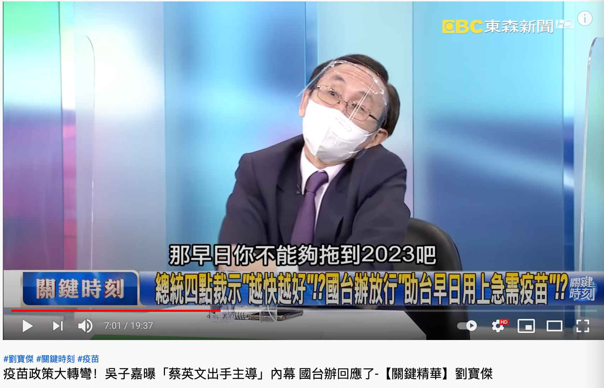

**统一台湾事件梳理**

中国百年民族复兴

民进党党纲基本主张

台湾前途决议文 https://taiwannext.com/%E8%87%BA%E7%81%A3%E5%89%8D%E9%80%94%E6%B1%BA%E8%AD%B0%E6%96%87/

2005年3月14日第十届全国人民代表大会第三次会议通过《反分裂国家法》

2017年9月29日，中共中央总书记习近平主持召开中共中央政治局会议，决定启动宪法修改工作。

2018年3月11日表决通过并同日施行修宪，其中一条：取消国家主席和国家副主席的连任限制，宪法第七十九条第三款删除“国家主席、副主席连续任职不得超过两届”。

2019年1月2日早间在《告台湾同胞书》发表**40**周年纪念会上的讲话中提出，两岸长期存在的政治分歧问题是影响两岸关系行稳致远的总根子，总不能一代一代传下去。中国人不打中国人。

（从1949至今72年，20岁去台湾的国民党人已经92岁。）

2019年1月2日下午，蔡英文回复不接受九二共识

2019年6月香港反送中

2019年12月新冠肺炎

2021年2月14日中共中央、国务院印发《国家综合立体交通网规划纲要》，

其中指出2035年京台高铁

我国的G3高速就是“京台高速”，是规划连接北京和台北的交通干线。2020年国庆节，京台高速公路长乐—平潭段正式通车，就差平潭—新竹—台北段了。

https://www.zhihu.com/tardis/sogou/qus/446903919

共青团微博说修路到台湾我们是认真的

台湾海峡通道最晚什么时候动工？预测2023年10月 https://zhuanlan.zhihu.com/p/430539779

2021年3月1日起禁止台湾凤梨输入

2021年3月24日 英特尔建晶圆厂

2021年5月12日，国台办发言人朱凤莲证实吴钊燮已被大陆列入“台独”顽固分子清单。

2021年5月3日，陆籍男子今(1日)凌晨在台中的西马头被发现,自称是从大陆福建开橡皮艇来台湾。

2021年5月13日，台湾大停电

2022年北京冬奥会

2021年6月19日

蔡政府同意经复星采购bnt，吴子嘉暗示2023年

https://www.youtube.com/watch?v=cxq__KMCoqs

2021年9月18日禁止释迦莲雾进口

2021年9月23日召开的第三次芯片峰会上，美国以芯片短缺为由，要求台积电、三星等芯片制造商交出库存量、订单、销售记录等数据。

2021年9月25日朱立伦当选国民党主席，习近平贺电，首次提出”为国家谋统一“

2021年9月26日电 全国台联成立40周年纪念大会暨第五届台胞社团论坛开幕式26日在京举行。中共中央政治局常委、全国政协主席汪洋出席并讲话。

首次未提“和平统一，一国两制”

汪洋强调，当前两岸关系发展机遇和挑战并存。两岸同胞要从中华民族根本利益出发，矢志坚守追求统一、支持统一、捍卫统一的民族大义，坚决反对任何形式的“台独”分裂行径，增强做中国人的志气、骨气、底气。要看清祖国必须统一也必然统一的历史大势，深刻认识解决台湾问题的主动权主导权始终掌握在祖国大陆这一边，坚定实现祖国完全统一的信心，广泛汇聚促进祖国统一的强大正能量。

30大讲话 http://www.taiwan.cn/xwzx/la/201111/t20111114_2152618.htm

20大讲话 http://www.taiwan.cn/lshshj/200202/t20020226_2304.htm

2021年9月30日，国台办发言人就吴钊燮猖狂谋“独”发表谈话。

2021年9月30日，国防部正告日本！“台湾的事，是中国的事，不关日本什么事”
日本防卫大臣岸信夫近日表示，中国以不透明的方式持续高水平地增加国防开支，加强军事力量，引发日本等地区国家和国际社会强烈担忧。钓鱼岛是日领土，日将捍卫相关岛屿主权。日台地理位置接近，台若出事，日亦无法置身事外。日防卫副大臣中山泰秀称，台湾有事就是日本有事。

2021年 解放军继10月1日、2日分别派出38架次、39架次军机进入台“防空识别区”后，解放军3日派出16架次军机进入台西南空域“防空识别区”。报道宣称，解放军最近3天已派93架次军机“扰台”，创台湾国防部公布统计以来最多架次纪录。10月4日派出56架次不断刷新纪录。

2021年10月6日蔡英文投书美国《外交事务》专文，署名“President of Taiwan.”

2021年10月9日纪念辛亥革命110周年大会
习近平强调，台湾问题因民族弱乱而产生，必将随着民族复兴而解决。这是中华民族历史演进大势所决定的，更是全体中华儿女的共同意志。以和平方式实现祖国统一，最符合包括台湾同胞在内的中华民族整体利益。我们坚持“和平统一、一国两制”的基本方针，坚持一个中国原则和“九二共识”，推动两岸关系和平发展。两岸同胞都要站在历史正确的一边，共同创造祖国完全统一、民族伟大复兴的光荣伟业。中华民族具有反对分裂、维护统一的光荣传统。凡是数典忘祖、背叛祖国、分裂国家的人，从来没有好下场，必将遭到人民的唾弃和历史的审判。台湾问题纯属中国内政，不容任何外来干涉。任何人都不要低估中国人民捍卫国家主权和领土完整的坚强决心、坚定意志、强大能力。祖国完全统一的历史任务一定要实现，也一定能够实现。

2021年10月10日人民日报署名钟声发表文章：祖国完全统一的历史任务一定要实现，也一定能够实现

2021年10月10日中华民国110周年大会蔡英文提出中华明国72年说法，未提辛亥革命，未提孙中山。提出四个坚持：永遠要堅持自由民主的憲政體制，堅持中華民國與中華人民共和國互不隸屬，堅持主權不容侵犯併吞，堅持中華民國台灣的前途，必須要遵循全體台灣人民的意志。提出准备修改宪法。双十节logo英语标语篡改为TAIWAN NATIONAL DAY马英九批中华民国国庆变台湾国庆，朱立伦张亚中强调孙中山理念。

2021年10月10日国台办回应双十讲话：这篇讲话鼓吹“台独”、煽动对立，割裂历史、扭曲事实，以所谓“共识、团结”为幌子图谋绑架台湾民意，勾连外部势力，为其谋“独”挑衅张目。

2021年10月10日央视新闻微博发起话题  #台湾是祖国的宝岛#  导语：实现祖国完全统一是海内外中华儿女的共同愿望，是中华民族的共同意志！台湾是祖国的宝岛，祖国必须统一！

2021年10月18日中俄海军共同穿越日本北海道与本州岛之间的津轻海峡。

2021年10月28日秦安：祖国必须统一，不计代价地动如雷霆后，冬季到台北去看雨

2021年10月30日第四届“国家统一与民族复兴”研讨会。中共中央台办、国务院台办副主任刘军川在视频致辞中表示，广大台湾同胞要看清祖国统一、民族复兴既是大义，更具大利。统一后，不仅台湾的和平安宁将充分保障，经济发展也将得到充分增进，民生福祉将充分提升，台湾的财政收入尽可用于改善民生。台湾同胞在国际上腰杆会更硬，共同参与全球治理和人类命运共同体构建。

2021年11月5日，国台办点名台当局行政机构负责人苏贞昌、民意机构负责人游锡堃、涉外部门主管吴钊燮等极少数“台独”顽固分子，针对他们一段时期以来的谋“独”恶劣言行，大陆方面依法对清单在列的上述“台独”顽固分子实施惩戒，禁止其本人及家属进入大陆和香港、澳门特别行政区，限制其关联机构与大陆有关组织、个人进行合作，绝不允许其关联企业和金主在大陆谋利，以及采取其它必要的惩戒措施。

2021年11月7日美国总统国家安全事务助理沙利文称美中关系“不是新冷战”，美国不再寻求改变中国体制，而是想与中国“共存”。专家认为，沙利文的表态说明，美国已经放弃通过接触、施压改变中国政治制度的幻想。

2021年11月8日在最后期限日，台积电“妥协”，上交了数据，同时一如既往强调“没有披露任何客户的具体信息”（9月23日）

2021年11月12日中国公路发文 【小鹿说路：沿着高速去台湾，2035能实现吗？】

2021年11月15日针对美国国务卿布林肯近日有关涉台言论，外交部发言人赵立坚11月15日在例行记者会上说，中方在台湾问题上的立场是一贯的、明确的。我们对美方的错误言行表示坚决反对。美方40多年来在台湾问题上的表述已经走样、变味、倒退，背离了中美建交时美方与中方达成的共识。美方应该遵守的是一个中国原则和中美三个联合公报，这是中美两国的重要政治共识，也是中美关系的政治基础。“所谓‘与台湾关系法’也好，所谓‘对台六项保证’也罢，纯粹是美国国内一些势力炮制出来的，都与中美三个联合公报背道而驰，实质是将美国内法凌驾于国际义务之上，是非法、无效的。”
赵立坚说，一段时间以来，民进党当局和“台独”分裂势力推行“去中国化”，搞“一中一台”“两个中国”，勾连外部势力大搞谋“独”挑衅活动，这是台海和平稳定的最大威胁，也是当前台海局势紧张的根源。中国统一是不可阻挡的历史潮流，坚持一中原则也是国际社会普遍共识。一切为“台独”撑腰打气的行径都是对中国内政的干涉，都不利于维护台海和平与稳定。美方应恪守一个中国原则和中美三个联合公报规定，慎重妥善处理台湾问题，以免损害中美关系和台海和平稳定。（记者温馨、朱超）

2021年11月16日中美视讯会晤，习近平：中国实现完全统一，是全体中华儿女的共同愿望。我们是有耐心的，愿以最大诚意、尽最大努力争取和平统一的前景，但如果“台独”分裂势力挑衅逼迫，甚至突破红线，我们将不得不采取**断然**措施。